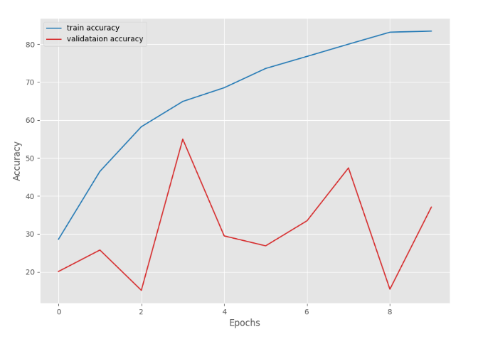
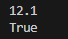

# วิธีติดตั้งเเละการใช้งาน 

สร้างไฟล์ :

 utils.py  เก็บฟังก์ชันอำนวยความสะดวก เช่น โหลดข้อมูล, เซฟกราฟ, แปลงรูปภาพ

 resnet18_torchvision.py  โค้ดสร้าง ResNet-18 โดยใช้โมดูลใน torchvision.models

 resnet18.py  เขียน ResNet-18 เองจากศูนย์ (custom)

 train.py  สคริปต์หลักสำหรับฝึกโมเดลเรียกใช้ utils.py, training_utils.py, และโมเดล

 test.py  ใช้ทดสอบประสิทธิภาพของความเเม่นยำ

โครงสร้างข้อมูลที่โมเดลเรียกใชเ้งาน :

├── data/                   
│   ├── train/               
│   │   ├── class1/          
│   │   │   ├── img001.jpg
│   │   │   ├── img002.jpg
│   │   ├── class2/          
│   │       ├── img003.jpg
│   │       ├── img004.jpg
│   └── test/                
│       ├── class1/
│       ├── class2/

## Preparation
ส่วนเตรียมข้อมูล(แต่ละคน)
1.	Dataset ที่ใช้
ใช้ Data set อาหารไทยโดยมี แกงเขียวหวาน ข้าวผัด ข้าวซอย แกงมัสหมัน ข้าวพักกระเพรา ผัดไทย ส้มตำ ต้มยำ ใช้สำหรับการเทรนและการเทส


2. 	Data Preparation
ในการเตรียมข้อมูลได้ช่วยกันหารูปภาพอาหารไทยจากอินเตอร์เน็ตและภาพที่ถ่ายด้วยกล้องมือถือ
โดยแบ่งการเทรนประมาณ 400 รูปภาพ และ การเทสเป็น 100 รูปภาพสัดส่วนจะเป็น
90/10ในการเทรนและเทสและได้ทำการดัดแปลงรูปภาพให้มีความหลากหลายมาขึ้น เช่น หมุนภาพ ปรับสีของภาพ ซูมภาพให้แคปลงหรือการเบลอภาพ เพื่อให้โมเดลได้เรียนรู้ข้อมูลที่หลากหลาย ตัวอย่าง


## Model-test
ส่วนของโมเดล(แต่ละคน)
อธิบาย Model ที่เลือกใช้
Model ที่เลือกใช้ โมเดล ResNet18 จาก PyTorch และ โมเดลสำเร็จรูป ResNet18 จากtorchvision ResNet18 จาก PyTorch เป็นโมเดลที่เราสามารถ Custom layer ในแบบของเราเองได้ส่วน โมเดลสำเร็จรูป สามารถเลือกโหลด weight ที่ฝึกมาแล้วหรือไม่ก็ได้และสามารถเลือก fine-tune หรือไม่ก็ได้

resnet18_torchvision.py :
```python


import torchvision.models as models
import torch.nn as nn

#โมเดลสำเร็จรูป ResNet18 จาก torchvision
#สามารถเลือกโหลด weight ที่ฝึกมาแล้วหรือไม่ก็ได้
#สามารถเลือก fine-tune หรือไม่ก็ได้
#num_classes คือจำนวนคลาสที่ต้องการจำแนก
#หากต้องการใช้โมเดลนี้ในงานอื่นๆ ควรตั้งค่า
#pretrained=False และ fine_tune=False เพื่อไม่ให้โหลด weight ที่ฝึกมาแล้ว
#และไม่ให้ปรับแต่ง weight ของเลเยอร์ที่ซ่อนอยู่
#หากต้องการใช้โมเดลนี้ในงานจำแนกภาพ ควร
#ตั้งค่า pretrained=True และ fine_tune=True เพื่อใช้ weight ที่ฝึกมาแล้ว      
def build_model(pretrained=True, fine_tune=True, num_classes=8):
    if pretrained:
        print("[INFO]: Loading pre-trained weights")
        model = models.resnet18(weights=models.ResNet18_Weights.DEFAULT)
    elif not pretrained:
        print("[INFO]: Not loading pre-trained weights")
        model = models.resnet18(weights=None)
    if fine_tune:
        print("[INFO]: Fine-tuning all layers...")
        for params in model.parameters():
            params.requires_grad = True
    elif not fine_tune:
        print("[INFO]: Freezing hidden layers...")
        for params in model.parameters():
            params.requires_grad = False

    # Change the final classification head, it is trainable.
    model.fc = nn.Linear(512, num_classes)
    return model


if __name__ == "__main__":
    model = build_model(num_classes=8)
    # Total parameters and trainable parameters.
    total_params = sum(p.numel() for p in model.parameters())
    print(f"{total_params:,} total parameters.")
    total_trainable_params = sum(
        p.numel() for p in model.parameters() if p.requires_grad
    )
    print(f"{total_trainable_params:,} training parameters.")
```
# Model resnet 18 architecture


ปกติถ้าเราส่งข้อมูล (ภาพ) ผ่านชั้น Convolution หลายๆชั้นมันจะค่อยๆ ดึงเอารายละเอียดและคุณสมบัติออกมาแต่ถ้าลึกมากๆบางครั้งข้อมูลที่ผ่านหลายชั้นไปจะเริ่ม เลือนทำให้โมเดลเรียนยากResNet แก้ปัญหานี้ด้วยการทำทางลัด (skip connection)
ข้อมูลเดิมจากชั้นก่อนๆจะถูกส่งตรงข้ามไปบวกกับข้อมูลใหม่ที่ผ่านการคำนวณแล้ว
เหมือนเราทำการบ้านแล้วครูเอาคำตอบเก่ามาบวกกับคำตอบใหม่ เพื่อไม่ให้ลืมข้อมูลสำคัญ

จากภาพคือ 
1.ภาพ (หรือข้อมูล) ผ่าน Convolution + ReLU (ชั้นปกติ)
2.ข้อมูลเดิมถูก เก็บไว้ เพื่อทำทางลัด
3.ข้อมูลใหม่ผ่าน Convolution อีก 1–2 ชั้น
4.เอาข้อมูลใหม่ บวก กับข้อมูลเดิม (skip connection)
5.ผ่าน ReLU อีกครั้งแล้วส่งต่อไปชั้นถัดไป

ResNet ทำให้โมเดล จำของเก่า และ เรียนของใหม่ ไปพร้อมกัน
เหมือนคุณฟังเพลงใหม่ แต่ยังจำเนื้อเพลงเก่าได้เลยไม่ลืมสิ่งที่เรียนมาก่อน

```python

# โมเดล ResNet18 จาก PyTorch
# ใช้โมเดลนี้เพื่อเรียนรู้การสร้างโมเดล ResNet18 ด้วย PyTorch
# และเข้าใจโครงสร้างของโมเดล ResNet18
# โมเดลนี้ไม่ใช่โมเดลที่สร้างจาก torchvision.models.resnet18
# แต่เป็นโมเดลที่สร้างขึ้นเองจากพื้นฐาน
# เพื่อให้เข้าใจการทำงานของโมเดล ResNet18 ได้ดียิ่งขึ้น
# โมเดลนี้ใช้ BasicBlock เป็นบล็อกหลักในการสร้างโมเดล
# และใช้ nn.Module เป็นคลาสหลักในการสร้างโมเดล  
import torch.nn as nn
import torch

from torch import Tensor
from typing import Type


class BasicBlock(nn.Module):
    def __init__(
        self,
        in_channels: int,
        out_channels: int,
        stride: int = 1,
        expansion: int = 1,
        downsample: nn.Module = None,
    ) -> None:
        super(BasicBlock, self).__init__()
        # Multiplicative factor for the subsequent conv2d layer's output channels.
        # It is 1 for ResNet18 and ResNet34.
        self.expansion = expansion
        self.downsample = downsample
        self.conv1 = nn.Conv2d(
            in_channels,
            out_channels,
            kernel_size=3,
            stride=stride,
            padding=1,
            bias=False,
        )
        self.bn1 = nn.BatchNorm2d(out_channels)
        self.relu = nn.ReLU(inplace=True)
        self.conv2 = nn.Conv2d(
            out_channels,
            out_channels * self.expansion,
            kernel_size=3,
            padding=1,
            bias=False,
        )
        self.bn2 = nn.BatchNorm2d(out_channels * self.expansion)

    def forward(self, x: Tensor) -> Tensor:
        identity = x

        out = self.conv1(x)
        out = self.bn1(out)
        out = self.relu(out)

        out = self.conv2(out)
        out = self.bn2(out)

        if self.downsample is not None:
            identity = self.downsample(x)

        out += identity
        out = self.relu(out)
        return out

# model ResNet18
class ResNet(nn.Module):
    def __init__(
        self,
        img_channels: int,
        num_layers: int,
        block: Type[BasicBlock],
        num_classes: int = 8,# Change num_classes as per your dataset
    ) -> None:
        super(ResNet, self).__init__()
        if num_layers == 18:
            # The following `layers` list defines the number of `BasicBlock`
            # to use to build the network and how many basic blocks to stack
            # together.
            layers = [2, 2, 2, 2]
            self.expansion = 1

        self.in_channels = 64
        # All ResNets (18 to 152) contain a Conv2d => BN => ReLU for the first
        # three layers. Here, kernel size is 7.
        self.conv1 = nn.Conv2d(
            in_channels=img_channels,
            out_channels=self.in_channels,
            kernel_size=7,
            stride=2,
            padding=3,
            bias=False,
        )
        self.bn1 = nn.BatchNorm2d(self.in_channels)
        self.relu = nn.ReLU(inplace=True)
        self.maxpool = nn.MaxPool2d(kernel_size=3, stride=2, padding=1)

        self.layer1 = self._make_layer(block, 64, layers[0])
        self.layer2 = self._make_layer(block, 128, layers[1], stride=2)
        self.layer3 = self._make_layer(block, 256, layers[2], stride=2)
        self.layer4 = self._make_layer(block, 512, layers[3], stride=2)

        self.avgpool = nn.AdaptiveAvgPool2d((1, 1))
        self.fc = nn.Linear(512 * self.expansion, num_classes)

    def _make_layer(
        self, block: Type[BasicBlock], out_channels: int, blocks: int, stride: int = 1
    ) -> nn.Sequential:
        downsample = None
        if stride != 1:
            """
            This should pass from `layer2` to `layer4` or
            when building ResNets50 and above. Section 3.3 of the paper
            Deep Residual Learning for Image Recognition
            (https://arxiv.org/pdf/1512.03385v1.pdf).
            """
            downsample = nn.Sequential(
                nn.Conv2d(
                    self.in_channels,
                    out_channels * self.expansion,
                    kernel_size=1,
                    stride=stride,
                    bias=False,
                ),
                nn.BatchNorm2d(out_channels * self.expansion),
            )
        layers = []
        layers.append(
            block(self.in_channels, out_channels, stride, self.expansion, downsample)
        )
        self.in_channels = out_channels * self.expansion

        for i in range(1, blocks):
            layers.append(
                block(self.in_channels, out_channels, expansion=self.expansion)
            )
        return nn.Sequential(*layers)

    def forward(self, x: Tensor) -> Tensor:
        x = self.conv1(x)
        x = self.bn1(x)
        x = self.relu(x)
        x = self.maxpool(x)

        x = self.layer1(x)
        x = self.layer2(x)
        x = self.layer3(x)
        x = self.layer4(x)
        # The spatial dimension of the final layer's feature
        # map should be (7, 7) for all ResNets.
        x = self.avgpool(x)
        x = torch.flatten(x, 1)
        x = self.fc(x)

        return x


if __name__ == "__main__":
    tensor = torch.rand([1, 3, 224, 224])
    model = ResNet(img_channels=3, num_layers=18, block=BasicBlock, num_classes=8) # Change num_classes as per your dataset
    print(model)

    # Total parameters and trainable parameters.
    total_params = sum(p.numel() for p in model.parameters())
    print(f"{total_params:,} total parameters.")
    total_trainable_params = sum(
        p.numel() for p in model.parameters() if p.requires_grad
    )
    print(f"{total_trainable_params:,} training parameters.")

    output = model(tensor)

```
utils.py :
```python

import matplotlib.pyplot as plt
import os

from torch.utils.data import DataLoader
from torchvision import datasets , transforms
from torchvision.transforms import ToTensor,Compose, Resize
from torchvision.datasets import ImageFolder

plt.style.use("ggplot")


def get_data(batch_size=64):
    # Transforms (คุณจะเพิ่ม augment ได้ในภายหลัง)
    transform = transforms.Compose([
        transforms.Resize((224, 224)),  # เพราะ ResNet18 ต้องใช้ input 224x224
        transforms.ToTensor(),
        transforms.RandomHorizontalFlip(),
        transforms.RandomRotation(10),
        transforms.ColorJitter(brightness=0.2, contrast=0.2, saturation=0.2)

    ])

    # Load custom training and validation datasets
    dataset_train = datasets.ImageFolder(
        root="data/Training", #  เปลี่ยนเป็น path ของ training set ของคุณ
        transform=transform
    )

    dataset_valid = datasets.ImageFolder(
        root="data/Testing",# เปลี่ยนเป็น path ของ validation set ของคุณ
        transform=transform
    )

    # Create data loaders.
    train_loader = DataLoader(dataset_train, batch_size=batch_size, shuffle=True)
    valid_loader = DataLoader(dataset_valid, batch_size=batch_size, shuffle=False)

    return train_loader, valid_loader


def save_plots(train_acc, valid_acc, train_loss, valid_loss, name=None):
    """
    Function to save the loss and accuracy plots to disk.
    """
    # Accuracy plots.
    plt.figure(figsize=(10, 7))
    plt.plot(train_acc, color="tab:blue", linestyle="-", label="train accuracy")
    plt.plot(valid_acc, color="tab:red", linestyle="-", label="validataion accuracy")
    plt.xlabel("Epochs")
    plt.ylabel("Accuracy")
    plt.legend()
    plt.savefig(os.path.join("outputs", name + "_accuracy.png"))

    # Loss plots.
    plt.figure(figsize=(10, 7))
    plt.plot(train_loss, color="tab:blue", linestyle="-", label="train loss")
    plt.plot(valid_loss, color="tab:red", linestyle="-", label="validataion loss")
    plt.xlabel("Epochs")
    plt.ylabel("Loss")
    plt.legend()
    plt.savefig(os.path.join("outputs", name + "_loss.png"))
```
training_utils.py :
```python


import torch
from tqdm import tqdm

# Training function.
def train(model, trainloader, optimizer, criterion, device):
    model.train()
    print("Training")
    train_running_loss = 0.0
    train_running_correct = 0
    counter = 0
    for i, data in tqdm(enumerate(trainloader), total=len(trainloader)):
        counter += 1
        image, labels = data
        image = image.to(device)
        labels = labels.to(device)
        optimizer.zero_grad()
        # Forward pass.
        outputs = model(image)
        # Calculate the loss.
        loss = criterion(outputs, labels)
        train_running_loss += loss.item()
        # Calculate the accuracy.
        _, preds = torch.max(outputs.data, 1)
        train_running_correct += (preds == labels).sum().item()
        # Backpropagation
        loss.backward()
        # Update the weights.
        optimizer.step()

    # Loss and accuracy for the complete epoch.
    epoch_loss = train_running_loss / counter
    # epoch_acc = 100. * (train_running_correct / len(trainloader.dataset))
    epoch_acc = 100.0 * (train_running_correct / len(trainloader.dataset))
    return epoch_loss, epoch_acc


# Validation function.
def validate(model, testloader, criterion, device):
    model.eval()
    print("Validation")
    valid_running_loss = 0.0
    valid_running_correct = 0
    counter = 0

    with torch.no_grad():
        for i, data in tqdm(enumerate(testloader), total=len(testloader)):
            counter += 1

            image, labels = data
            image = image.to(device)
            labels = labels.to(device)
            # Forward pass.
            outputs = model(image)
            # Calculate the loss.
            loss = criterion(outputs, labels)
            valid_running_loss += loss.item()
            # Calculate the accuracy.
            _, preds = torch.max(outputs.data, 1)
            valid_running_correct += (preds == labels).sum().item()

    # Loss and accuracy for the complete epoch.
    epoch_loss = valid_running_loss / counter
    epoch_acc = 100.0 * (valid_running_correct / len(testloader.dataset))
    return epoch_loss, epoch_acc

```
train.py :
```python

import torch
import torch.nn as nn
import torch.optim as optim
import argparse
import numpy as np
import random

from resnet18 import ResNet, BasicBlock
from resnet18_torchvision import build_model
from training_utils import train, validate
from utils import save_plots, get_data

parser = argparse.ArgumentParser()
parser.add_argument(
    "-m",
    "--model",
    default="scratch",
    help="choose model built from scratch or the Torchvision model",
    choices=["scratch", "torchvision"],
)
args = vars(parser.parse_args())

# Set seed.
seed = 42
torch.manual_seed(seed)
torch.cuda.manual_seed(seed)
torch.backends.cudnn.deterministic = True
torch.backends.cudnn.benchmark = True
np.random.seed(seed)
random.seed(seed)

# Learning and training parameters.
epochs = 25 # 25จำนวนรอบการฝึกโมเดล 
batch_size = 64 #64 ยิ่งมากยิ่งช้า
learning_rate = 0.002 #0.002 ความถี่ในการเรียนรู้ ยิ่งน้อยยิ่งช้า
device = torch.device("cuda:0" if torch.cuda.is_available() else "cpu")

#ดึง data loader จาก utils.py
train_loader, valid_loader = get_data(batch_size=batch_size)

# Define model based on the argument parser string.
# คำสั่ง Train ใน Terminal python train.py -m scratch เรียกใช้โมเดลนี้ กดไฟล์รันตามลำดับ utils training_utils resnet18 train

if args["model"] == "scratch":
    print("[INFO]: Training ResNet18 built from scratch...")
    model = ResNet(img_channels=3, num_layers=18, block=BasicBlock, num_classes=8).to( # Change num_classes as per your dataset
        device
    )
    plot_name = "resnet_scratch"

# คำสั่งใน terminal python train.py -m torchvision เรียกใช้โมเดลนี้
if args["model"] == "torchvision":
    print("[INFO]: Training the Torchvision ResNet18 model...")
    model = build_model(pretrained=True, fine_tune=True, num_classes=8).to(device)
    plot_name = "resnet_torchvision"
print(model)

# Total parameters and trainable parameters.
total_params = sum(p.numel() for p in model.parameters())
print(f"{total_params:,} total parameters.")
total_trainable_params = sum(p.numel() for p in model.parameters() if p.requires_grad)
print(f"{total_trainable_params:,} training parameters.")

# Optimizer.
optimizer = optim.SGD(model.parameters(), lr=learning_rate)
# Loss function.
criterion = nn.CrossEntropyLoss()

if __name__ == "__main__":
    # Lists to keep track of losses and accuracies.
    train_loss, valid_loss = [], []
    train_acc, valid_acc = [], []
    # Start the training.
    for epoch in range(epochs):
        print(f"[INFO]: Epoch {epoch+1} of {epochs}")
        train_epoch_loss, train_epoch_acc = train(
            model, train_loader, optimizer, criterion, device
        )
        valid_epoch_loss, valid_epoch_acc = validate(
            model, valid_loader, criterion, device
        )
        train_loss.append(train_epoch_loss)
        valid_loss.append(valid_epoch_loss)
        train_acc.append(train_epoch_acc)
        valid_acc.append(valid_epoch_acc)
        print(
            f"Training loss: {train_epoch_loss:.3f}, training acc: {train_epoch_acc:.3f}"
        )
        print(
            f"Validation loss: {valid_epoch_loss:.3f}, validation acc: {valid_epoch_acc:.3f}"
        )
        print("-" * 50)

    # Save the loss and accuracy plots.
    save_plots(train_acc, valid_acc, train_loss, valid_loss, name=plot_name)
    print("TRAINING COMPLETE")

    # Save the trained model weights
    torch.save(model.state_dict(), f"{plot_name}.pth")
    print(f"Model saved as {plot_name}.pth")

```


## Evaluation
ส่วนประเมินโมเดล(แต่ละคน)
test.py :
```python

import torch
import torch.nn as nn
from torchvision import models, transforms, datasets
from torch.utils.data import DataLoader
from collections import defaultdict

def main():
    test_dir = "data/Testing"
    model_path = "resnet_torchvision.pth" # Path to the trained model weights
    batch_size = 64
    device = torch.device("cuda" if torch.cuda.is_available() else "cpu")

    class_names = [
        "Green_Curry",
        "Khao_phat",
        "Khao_Soi",
        "Massaman_Curry",
        "Pad_Krapraw",
        "Pad_Thai",
        "SomTum",
        "Tom_yum"
    ]
    num_classes = len(class_names)

    test_transform = transforms.Compose([
        transforms.Resize(256),
        transforms.CenterCrop(224),
        transforms.ToTensor(),
        transforms.Normalize([0.485, 0.456, 0.406],
                             [0.229, 0.224, 0.225])
    ])

    test_dataset = datasets.ImageFolder(root=test_dir, transform=test_transform)
    test_loader = DataLoader(test_dataset, batch_size=batch_size, shuffle=False, num_workers=4)

    idx_to_class = {v: k for k, v in test_dataset.class_to_idx.items()}
    print("Classes in dataset:", idx_to_class)

    model = models.resnet18(pretrained=False)
    model.fc = nn.Linear(model.fc.in_features, num_classes)
    model.load_state_dict(torch.load(model_path, map_location=device))
    model = model.to(device)
    model.eval()

    total = 0
    correct = 0
    per_class_total = defaultdict(int)
    per_class_correct = defaultdict(int)

    with torch.no_grad():
        for images, labels in test_loader:
            images = images.to(device)
            labels = labels.to(device)

            outputs = model(images)
            _, preds = torch.max(outputs, 1)

            total += labels.size(0)
            correct += (preds == labels).sum().item()

            for t, p in zip(labels.cpu().numpy(), preds.cpu().numpy()):
                per_class_total[t] += 1
                if t == p:
                    per_class_correct[t] += 1

    overall_acc = 100.0 * correct / total if total > 0 else 0.0
    print(f"\nOverall accuracy: {overall_acc:.2f}%  ({correct}/{total})")

    print("\nPer-class accuracy:")
    for idx in sorted(idx_to_class.keys()):
        cname = idx_to_class[idx]
        tot = per_class_total[idx]
        corr = per_class_correct[idx]
        acc = 100.0 * corr / tot if tot > 0 else 0.0
        print(f" - {cname}: {acc:.2f}%  ({corr}/{tot})")

if __name__ == '__main__':
    main()
```
1.การทำงานของ Model resnet 18 ที่ใช้
โหมด Fine-tuning (ปรับแต่งทั้งหมด)
ใช้ ResNet-18 ที่เทรนมาแล้ว: โค้ดจะโหลดน้ำหนัก (weights) ที่ถูกเทรนมาแล้วจากชุดข้อมูลขนาดใหญ่ (เช่น ImageNet)ปรับแต่งทุกส่วนของโมเดล: ทุกส่วนของโมเดลจะถูกปลดล็อกและพร้อมให้ปรับปรุงแก้ไข (trainable)การเปลี่ยนแปลงส่วนท้าย: ชั้นสุดท้าย (classification head) จะถูกเปลี่ยนให้เหมาะสมกับการจำแนก 8 คลาสตามที่เราต้องการเหมาะสำหรับงานที่มีข้อมูลจำนวนมากและต้องการความแม่นยำสูง

2.โหมด Feature Extraction (ตรึงบางส่วน)
ใช้ ResNet-18 ที่เทรนมาแล้ว: โค้ดจะโหลดน้ำหนักที่ถูกเทรนมาแล้ว
ตรึงชั้นภายใน: ชั้น Convolutional (hidden layers) ส่วนใหญ่จะถูกตรึงไว้ ทำให้โมเดลเรียนรู้คุณสมบัติ (features) เดิมที่เคยเรียนมาปรับแต่งเฉพาะส่วนท้าย: จะมีการปรับปรุงแก้ไขเฉพาะชั้นสุดท้าย (classification head) ที่เราเปลี่ยนใหม่เท่านั้นเหมาะสำหรับ: งานที่มีข้อมูลจำนวนจำกัดและต้องการความรวดเร็วในการเทรน

3.โหมดเทรนจากศูนย์
ใช้ ResNet-18 เปล่าๆ: โมเดลนี้จะไม่มีน้ำหนักที่ถูกเทรนมาเลย
เทรนทุกส่วนของโมเดล: ทุกชั้นของโมเดลจะต้องถูกเทรนใหม่ทั้งหมด
เหมาะสำหรับ: งานที่มีข้อมูลจำนวนมหาศาลและต้องการสร้างโมเดลที่มีความเฉพาะเจาะจงสูง
สรุป: โค้ดนี้เป็นเหมือนเครื่องมือที่ช่วยให้เราสามารถสร้างโมเดล ResNet-18 สำหรับการจำแนกประเภทภาพได้อย่างยืดหยุ่น โดยสามารถเลือกว่าจะใช้ความรู้เดิมจากโมเดลที่เคยเทรนมาแล้วหรือไม่ และจะปรับปรุงแก้ไขโมเดลในส่วนไหนบ้าง เพื่อให้เหมาะสมกับงานและปริมาณข้อมูลที่เรามีครับ

4.	การ Training/Testing โมเดล


-จาการเทรนจะเห็นได้ว่าโมเดลมีการเรียนรู้ได้ดีไม่เกิด Over fiting ค่าที่ไม่มาดีที่สุดจาการทำครั้งนี้
Traning acc: 98.153 Validation acc:97.603 Training loss:0.103 Validation loss: 0.098

# กราฟ


การวิเคราะห์กราฟ
กราฟค่าAccuracy เพิ่มขึ้นทั้งเส้น (train accuracy) และเส้น (validation accuracy) มีแนวโน้มเพิ่มขึ้นอย่างต่อเนื่อง แสดงให้เห็นว่าประสิทธิภาพของโมเดลดีขึ้นเรื่อยๆ


การวิเคราะห์กราฟ
กราฟค่า Loss ลดลงเรื่อยๆ ทั้งเส้น (train loss) และ (validation loss) มีแนวโน้มลดลงอย่างต่อเนื่องตั้งแต่ช่วงแรกจนถึงช่วงสุดท้ายของการฝึก แสดงให้เห็นว่าโมเดลกำลังเรียนรู้และลดความผิดพลาดได้ดี

5.	สรุปผลการจำแนก
จำแนกnum_class ได้ทั้งหมด 8 class มีแกงเขียวหวาน ข้าวผัด ข้าวซอย แกงมัสหมัน ข้าวพักกระเพรา ผัดไทย ส้มตำ ต้มยำ 


การจำแนกในการทำครั้งนี้ได้ใช้ รูปภาพอาหารไทยจากอินเตอร์เน็ตและภาพที่ถ่ายด้วยกล้องมือถือ
โดยแบ่งการเทรนประมาณ 400 รูปภาพ และ การเทสเป็น 100 รูปภาพ สัดส่วนจะเป็น 90/10
การจำแนก  Training 400 , Testing 100

!!

จำแนกได้ว่า
 Pad Krapraw: โมเดลทายถูก 71% (71 จาก 100) ซึ่งถือว่าทำได้ดีที่สุด 
Tom yum: โมเดลทายถูกแค่ 6% (6 จาก 100) ซึ่งเป็นประสิทธิภาพที่แย่ที่สุดในรายการ
และอื่นๆตามรายการ 

6.	ปัญหา/อุปสรรค และข้อเสนอแนะ
 1.ปัญหาที่พบเจอคือการเกิด Over fitting ของการเทรนเกิดจากการปรับค่า learning rate ที่มากเกินไปและไม่ได้ดันแปลงรูปภาพก่อนการเทรน 



 

 หลังจาการปรับค่า epochs=25 batch_size=64 และ learning_rate =0.001


ข้ออเสนอแนะการอ่านกราฟให้เป็นมีประโยชน์ในการปรับจูนอย่างมาก ควรค่อยๆปรับที่ละเล็กน้อยเพิ่มค่าค่าที่เหมาะสมที่สุดที่ให้โมเดลในการเรียนรู้ ค่าtrain accuracy validataion accuracy ควรเพิ่มขึ้นเรื่อยๆแต่ละรอบ epochs และ Train loss Validataion loss ควรลดลงอย่างต่อเนื่องไม่ผันผวนสูงเกินไป ค่าที่ดีควรทำให้กราฟไม่สวิงหรือผันผวนมาก.

2.ปัญหาในการติดตั้งโมเดลที่ใช้สำหรับการเทรน การติดตั้งไลบรารีบางตัวที่คนละ version จึงไม่สามารถทำงานได้ จึงทำการแก้ไขและเช็คให้ถูกต้อง

```python
pip install torch torchvision torchaudio --extra-index-url https://download.pytorch.org/whl/cu121
```




สุดท้าย การจำแนกอาหารแต่ละประเภท

 !!

จากภาพจะเห็นได้ว่า โมเดลนี้ยังทำงานได้ไม่ดีนัก เพราะหลายๆ ประเภทอาหารมีความแม่นยำต่ำมาก โดยเฉพาะ Tom yum, SomTum และ Khao phat ที่ทำได้เพียง 6-10% เท่านั้น 
เนื่องจากอาหารใน 8 class มีอาหารที่ใกล้เคียงกันเลยทำให้โมเดลไม่รู้ได้อย่างชัดเจนวิธีเเก้ไขคือการเพิ่มข้อมูลที่มากขึ้น .


