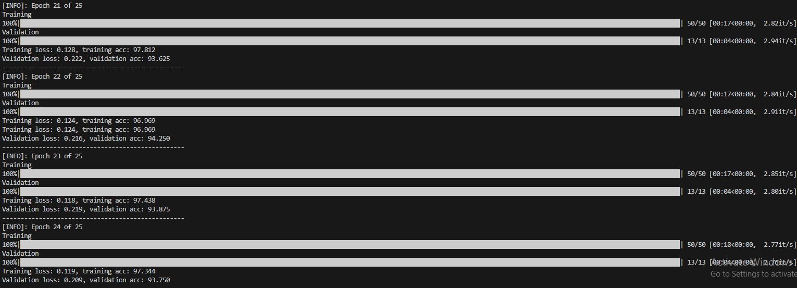

# อธิบายไฟล์ต่างๆ(จะได้เข้าใจกัน)

## requirements.txt
จะรวมรวบ lib ต่างๆของแต่ละคน(แต่ละคนจะมีไม่เหมือนกัน)

ตัวอย่าง:

```bash
# ใช้ PyTorch GPU (CUDA 11.8) จาก repo พิเศษของ PyTorch
torch==2.7.1+cu118
torchvision==0.22.1+cu118
torchaudio==2.7.1+cu118

# Index พิเศษของ PyTorch สำหรับ CUDA 11.8
--extra-index-url https://download.pytorch.org/whl/cu118

# packages อื่นๆ ที่ไม่ขึ้นกับ torch version โดยตรง
einops>=0.6.0
matplotlib>=3.5.0
opencv-python>=4.5.0
pillow>=9.0.0
torchsummary>=1.5.1
scikit-learn>=1.0
tqdm>=4.60.0
pandas>=1.3.0
```

วิธีติดตั้ง :

    py -m pip install requirements.txt

ติดตั้งผ่านไฟล์ .venv

## Preparation
ส่วนเตรียมข้อมูล(แต่ละคน)
1.	Dataset ที่ใช้
ใช้ Data set อาหารไทยโดยมี แกงเขียวหวาน ข้าวผัด ข้าวซอย แกงมัสหมัน ข้าวพักกระเพรา ผัดไทย ส้มตำ ต้มยำ ใช้สำหรับการเทรนและการเทส


2. 	Data Preparation
ในการเตรียมข้อมูลได้ช่วยกันหารูปภาพอาหารไทยจากอินเตอร์เน็ตและภาพที่ถ่ายด้วยกล้องมือถือ
โดยแบ่งการเทรนประมาณ 400 รูปภาพ และ การเทสเป็น 100 รูปภาพ สัดส่วนจะเป็น 90/10 ในการเทรนและเทส  และได้ทำการดัดแปลงรูปภาพให้มีความหลากหลายมาขึ้น เช่น หมุนภาพ ปรับสีของภาพ ซูมภาพให้แคปลงหรือการเบลอภาพ เพื่อให้โมเดลได้เรียนรู้ข้อมูลที่หลากหลาย ตัวอย่าง





## Model-test
ส่วนของโมเดล(แต่ละคน)

## Evaluation
ส่วนประเมินโมเดล(แต่ละคน)

## เพิ่มเติม
จะเขียนรวมในไฟล์ Model-test อันเดี่ยวเลยก็ได้น่ะ แต่แบ่ง section ให้หน่อยน่ะ
