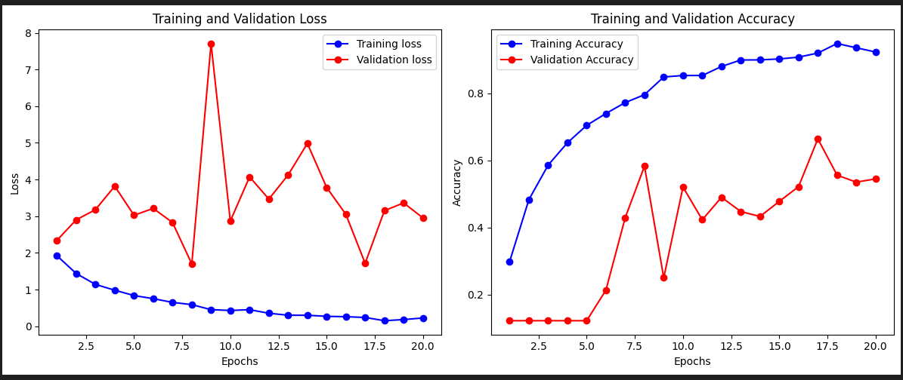

# NOTE

## Dataset ที่ใช้
8 class
Green_Curry train 400 test 100 
Khao_phat train 394 test 110 
Khao_Soi  train 400 test 100 
Massaman_Curry train 400 test 100 
Pad_Krapraw train 400 test 100 
Pad_Thai train 400 test 100 
SomTum train 400 test 100 
Tom_yum train 402 test 110

## Data Preparation
1. อ่านชื่อโฟลเดอร์ย่อยใน src_dir เพื่อใช้เป็น class name
2. Map ชื่อ class เป็นตัวเลข
3. โหลดภาพทั้งหมดจากแต่ละ class
4. ปรับขนาดและ normalize ให้เหมาะกับการป้อนเข้าโมเดล
5. ส่งคืนข้อมูลภาพและ label

## การ Training/Testing โมเดล
1. โหลดข้อมูล
    โหลด Training set → X_train, y_train
    โหลด Test set → X_test, y_test (ใช้เป็น validation ระหว่างเทรน)
2. สร้างโมเดล MobileNetV2
    Input shape: (224, 224, 3)
    จำนวนคลาส (k): 8
3. ตั้งค่าโมเดล (Compile)
    Optimizer: adam (learning rate = 0.001)
    Loss: sparse_categorical_crossentropy
    Metrics: accuracy
4. ฝึกสอนโมเดล (Train)
    batch_size=32
    epochs=20
    ใช้ validation_data=(X_test, y_test)
5. จับระยะเวลาในการเทรนโมเดล
    จับตอนเริ่ม และตอนเสร็จ
    นำมาลบกัน(ตอนเสร็จ-ตอนเริ่ม)
    คำนวณเวลารวม(hr:min:sec)
6. บันทึกผลลัพธ์ (Save history)
    เก็บ loss, accuracy, val_loss, val_accuracy เป็น JSON
    เพื่อส่งไปในไฟล์ Evaluation.ipynb

## สรุปผลการจำแนก
ผลการ train ออกมาค่อนข้างดีแต่ validate ออกมาค่อนข้างไม่ดี 
    train_accuracy: 0.9236 
    train_loss: 0.2262 
    vali_accuracy: 0.5451 
    vali_loss: 2.9531 

ระยะเวลาในการเทรน 1 hr 17 min 30 sec

## อธิบายปัญหา/อุปสรรค และข้อเสนอแนะ
### ปัญหา
1. tensorflow เวอร์ชั่นใหม่ๆไม่รองรับการ์จออีกแล้วจึงต้องใช้ wsl ช่วย
2. ตอนเทรนผ่าน wsl ทรัพยากรณ์ไม่เพียงพอ (Ubuntu train model ไม่ไหว)
3. ตอนเทรนค่า validation ออกมาไม่ดีมากนัก คิดว่าน่าจะเป็นปัญหาของ Overfitting

### ข้อเสนอแนะ
1. แนะนำใช้ pytouch ในการเทรนดีกว่า tensorflow
2. ควรปรับ data แต่ละ class ให้น้อยลงกว่านี้เพราะว่า data มีรูปที่ซ้ำกันมากเกินไป

## แหล่งอ้างอิ้ง
[ลิ้งแหล่งอ้างอิ้ง](https://github.com/kittipat12zxc/Project-CNNs-Group/tree/main/note)

## dataset
[ผัดไทย1](https://universe.roboflow.com/thaifood/thai_food-y98fg/browse?queryText=class%3A%22Thai+Stir-fried+Noodle%22&pageSize=50&startingIndex=0&browseQuery=true)
[ผัดไทย2](https://www.kaggle.com/datasets/sorawitsinlapanurak/top-10-best-rated-thai-food)
[ผัดไทย3](https://universe.roboflow.com/projectwachi/pad-thai-b68nq/dataset/1)
[ข้าวผัด](https://www.kaggle.com/datasets/sorawitsinlapanurak/top-10-best-rated-thai-food)
[ต้มยำ](https://www.kaggle.com/datasets/sorawitsinlapanurak/top-10-best-rated-thai-food)
[แกงเขียวหวาน1](https://www.kaggle.com/datasets/sorawitsinlapanurak/top-10-best-rated-thai-food/data)
[แกงเขียวหวาน2](https://universe.roboflow.com/food-buddy/thai-food-csvmo)
[แกงมัสมัน1](https://universe.roboflow.com/food-zndig/chicken-curry-iv85w)
[แกงมัสมัน2](https://universe.roboflow.com/james-vv9va/curry-cimej)
[ข้าวซอย1](https://universe.roboflow.com/test-xszsk/khao-soi)
[ข้าวซอย2](https://universe.roboflow.com/projectwachi/khao-soi-qdige)
